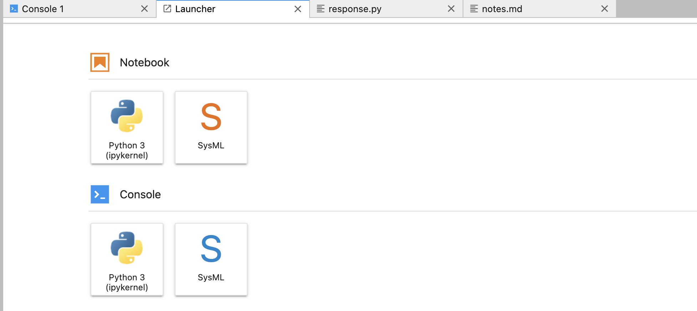

# SysML-workspace
Some notes and examples for SysML Kernels


### Getting Started

To set up the SysML Jupyter Kernel, first run the install.sh file to download the necessary requirements.

Since Conda is required to download the requirements, I would suggest downloading Conda here:
https://docs.conda.io/projects/conda/en/latest/user-guide/install/index.html 

Along with setting up a conda environment for sysml via `conda create --name sysml` and `conda activate sysml` 

### Installation Troubleshooting

If your versions don't resolve, you can modify the following line in install.sh

```xs
conda install "jupyter-sysml-kernel=$SYSML_VERSION" python=3.* jupyterlab=2.* graphviz=2.46.* nodejs=15.8.* -c 
```

Just make sure nodejs >= 14.0 and graphviz >= 2.4

### Jupyter 

Make sure Jupyter is installed and run `jupyter lab`. 

When your kernel is up, you should see SysML option when you try to add a new notebook in the kernel like so:



Otherwise, you installation has failed or you have not added the extension in the kernel.

Make sure to run `conda deactivate` when your done.